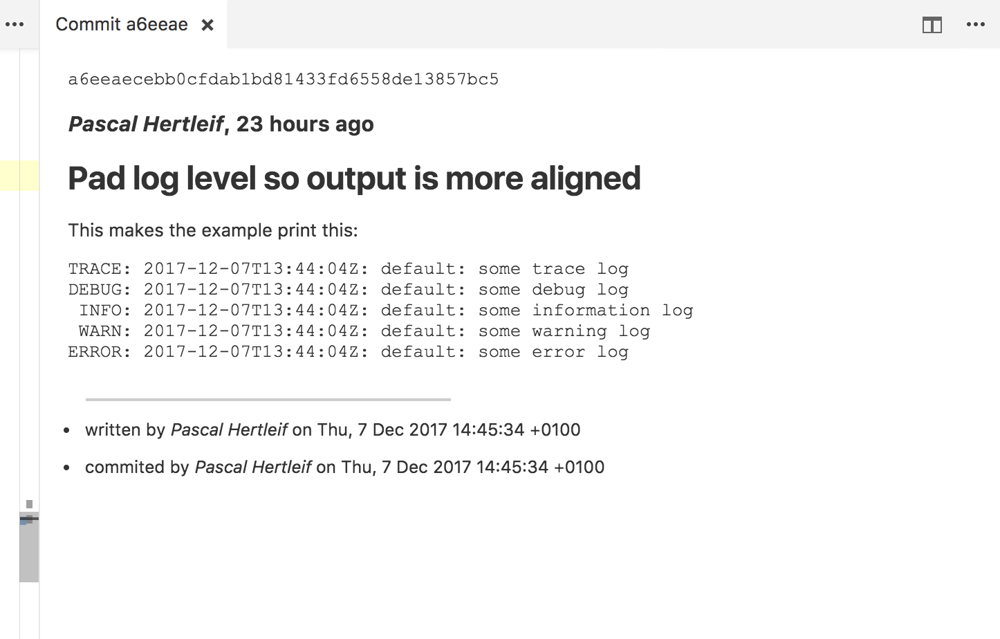

# Why-in-the-git VSCode extension

A VSCode extension that gives you a command to show the commit message
corresponding to the latest change to the line your cursor is on.

## Usage

1. Install the extension.
2. Open the command panel and look for "Show corresponding commit message"
3. ???
4. PROFIT!

## FAQ

**Why not just use _Git Lens_?**

It doesn't show the _full_ commit message.

**Why not use _Git History_?**

It takes more than one step to get the _full_ commit message.

**Why not patch one of the other extensions?**

I like small extensions, and I wanted to figure out how to write one myself.

**Is this any good?**

Yes.
